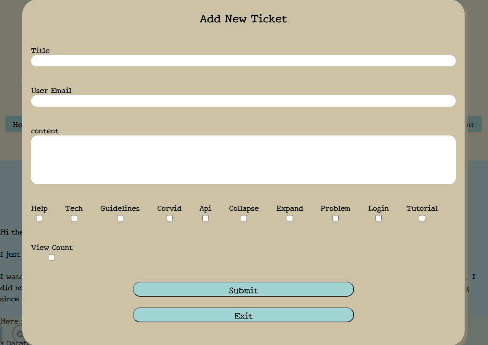

# Ticket Manager

## View it Live

- [Link to heroku](https://eyal-ticket-manager.herokuapp.com/)

## Filter by label

To filter tickets by label click the label you'd like to see.

 
 
 

## Add new ticket

Click the yellow plus button, and a form will pop up.
Fill the form and click Submit to add your ticket or Exit if you regret.
You can add labels to your ticket (optional), choose what you want😉

 

 
 
 

## More features i added

- Back to top button 👆🏻

- Done and Undone button for each ticket

 

- Footer for being able to contact me 📱😃

